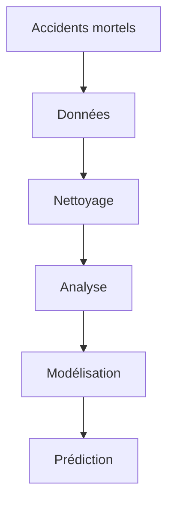

# ProjetE3FIAccidentsMortels

## User Guide
- (1) Télécharger le projet sur votre ordinateur en utilisant la commande suivante : `git clone adresse_du_projet`
- (2) Récupérer tous les packages additionnels en utilisant la commande suivante : `python -m pip install -r requirements.txt`
- (3) Récupérer les datas en utilisant la commande suivante : `python get_data.py`
- (4) Lancer le programme en utilisant la commande suivante : `python main.py`

## Rapport d'analyse
Grâce à cette visualisation de données, nous pouvons tirer une conclusion de l'accident 'typique' qui peut se produire
avec un profil type de conducteur. Les accidents les plus récurrents sont les suivants :
- sexe : masculin
- âge : 20-24 ans
- type de véhicule : voiture
- gravité de l'accident : indemne
- heure de l'accident : 16h-18h
- lieu : Paris et sa banlieue

## Developer Guide
L'architecture du projet est la suivante :
- `main.py` : Fichier principal du projet
- `get_data.py` : Fichier permettant de récupérer les données
- `data` : Dossier contenant les données
- `scripts` : Dossier contenant les scripts de traitement des données

Le fichier `main.py` est le fichier principal du projet. C'est dans ce fichier que le dashboard est créé.
C'est également ici que les fonctions sont appelées. Les données sont traitées dans différents fichiers
situés dans le dossier `scripts`. Ces fichiers sont appelés dans le fichier `main.py`. Dans le dossier `script`,
chaque fichier correspond à un traitement différent. Les fichiers sont nommés en fonction de la donnée et du graphique
qu'ils traitent. Par exemple, le fichier `pie_chart_accident_by_ages.py` est un fichier qui traite le nombre d'accidents
en fonction de l'âge des conducteurs. Il retourne un pie chart (camembert) qui est affiché dans le dashboard.

Pour étendre le projet, il suffit de créer un nouveau fichier dans le dossier `scripts` et de l'appeler dans le fichier `main.py`.
Il faut également modifier la fonction dash_project() dans le fichier `main.py` pour ajouter le nouveau graphique au dashboard.